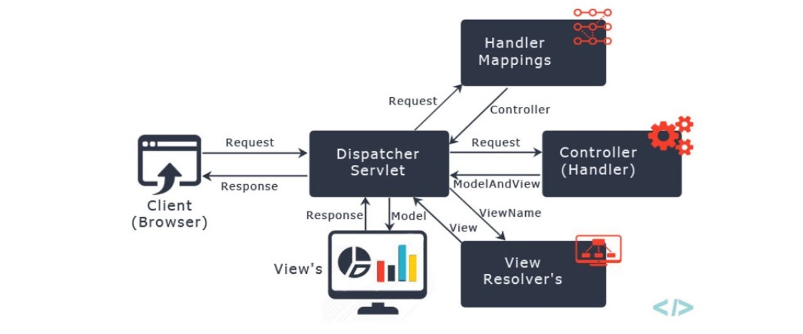

# CozinhaConecta

O CozinhaConecta é um software de automação para food service desenvolvido para oferecer uma solução simples, prática e acessível a pequenos restaurantes e lanchonetes. O sistema é multiplataforma, disponível em versões mobile e desktop, garantindo flexibilidade de uso.

Com o aplicativo mobile, os garçons podem registrar os pedidos diretamente na mesa do cliente, que são enviados automaticamente ao terminal da cozinha, otimizando o atendimento e reduzindo erros. Além disso, o sistema permite comunicação eficiente entre salão e cozinha por meio do envio de mensagens de voz e texto, facilitando a integração da equipe e aumentando a agilidade no serviço.

## 🎨 Design System
O Design Thinking, aplicado à arquitetura de software, é uma abordagem para a solução de problemas que coloca as necessidades do usuário no centro do processo de desenvolvimento. Em vez de focar apenas em requisitos técnicos, ele utiliza empatia, colaboração e experimentação para criar uma estrutura de software que seja não apenas tecnicamente robusta, mas também inovadora e eficaz para o cliente final.

## 🏗️ Arquitetura

### Estilo Arquitetural
Adotamos o estilo arquitetural **Cliente–Servidor**, no qual o processamento é distribuído entre o cliente — responsável pela interface e interação com o usuário — e o servidor, encarregado pelo gerenciamento centralizado dos dados e pela lógica de negócio. Essa escolha promove maior segurança e integridade da informação, pois os dados são mantidos em um único ponto de controle, além de facilitar a administração e a manutenção do sistema.
O modelo Cliente–Servidor atende aos requisitos de um sistema destinado a restaurantes e lanchonetes, uma vez que:
**Suporta escalabilidade**: é possível adicionar novos clientes à rede (por exemplo, novos dispositivos no estabelecimento principal ou em filiais) sem impactos significativos no desempenho, mediante otimização do backend e dimensionamento da infraestrutura de servidores;

- **Simplifica a manutenção**: alterações na lógica ou no banco de dados são realizadas no servidor, sendo refletidas automaticamente nos clientes;

- **Permite múltiplos pontos de acesso**: diversos dispositivos podem operar simultaneamente sobre a mesma base de dados, preservando consistência;

- **Aumenta a segurança**: com controle centralizado de permissões, auditoria e autenticação, reduz-se a exposição de dados sensíveis no cliente.

Dessa forma, o sistema pode ser acessado tanto por dispositivos móveis utilizados pelos garçons para registrar pedidos quanto por desktops ou terminais administrativos utilizados pelo caixa e pela gestão do estabelecimento, garantindo integração em tempo real entre todas as operações.

### Padrão Arquitetural
O padrão arquitetural adotado será o **MVC (Model-View-Controller)**, visando uma separação clara entre regras de negócio, lógica de apresentação e manipulação de dados. Isso facilita a evolução do sistema e promove um desenvolvimento mais organizado.

## Desenho Arquitetural
  
O diagrama representa o estilo arquitetural baseado em Cliente-Servidor, no qual existe uma separação física e lógica entre:

- **Cliente** – onde ocorre a interação do usuário (garçom, caixa, gerente);

- **Servidor** – onde residem as regras de negócio, o processamento e o armazenamento dos dados.

O estilo em questão premite a escalabilidade e centralização. Filiais e dispositivos extras podem ser adicionados sem alterar lógica de negócio.

Dentro do lado servidor, a aplicação segue o padrão arquitetural MVC (Model–View–Controller), o que organiza internamente o código em camadas com responsabilidades bem definidas.

  

Como o MVC se encaixa no lado servidor:

- O **Model**	Representa entidades como Pedido, Item, Mesa, Usuário; implementa regras como status do pedido, vínculo com cozinha, persistência em banco.

- O **View**	Responsável pelas respostas devolvidas aos clientes (ex.: JSON em APIs REST, páginas no painel web administrativo, ou templates).

- O **Controller**	Recebe requisições externas, orquestra modelos, aplica validações de entrada e devolve a resposta adequada.

Fluxo conceitual em contexto (exemplo de pedido pelo garçom):

- O garçom, usando um tablet (cliente), registra um novo pedido.

- O cliente envia uma requisição para o servidor (WebSocket).

- No servidor, o Controller recebe a requisição e decide o que fazer.

- O Controller chama o Model, que implementa as regras de negócio — por exemplo, validar mesa ativa, calcular valor, persistir no banco.

- O Model acessa o banco de dados para gravar o pedido.

- O Controller devolve uma resposta ao cliente, contendo o resultado.

- O cliente atualiza a interface (exibindo confirmação ou detalhes do pedido).

### Identidade Visual

#### Paleta de Cores

| Nome | Código HEX | Uso Principal |
|:---|:---|:---|
| Primária | #66CC33 | Backgrounds de cards, tags, botões de categoria |
| Secundária | #F0E600 | Botões de ação principais (Login, Adicionar) |
| Neutro Claro | #B2D900 | (Cor de suporte) |
| Neutro (Escuro) | #007E85 | (Cor de suporte) |
| Black | #000000 | Textos (sobre fundos claros/amarelos) |
| White | #FFFFFF | Textos (sobre fundos verdes) |
| Error | #EE0202 | Erros, alertas críticos |

#### 🖋️ Tipografia

| Tipo | Fonte Principal | Peso | Uso |
|:---|:---|:---|:---|
| Títulos | Poppins | Semibold | Títulos (ex: "Cozinha conecta") |
| Corpo | Poppins | Medium | Textos de ênfase |
| Auxiliar | Poppins | Regular | Textos gerais |

### Componentes UI

#### Botões

| Variante | Cor de Fundo | Cor do Texto | Uso |
|:---|:---|:---|:---|
| Primário (Ação) | #F0E600 | #000000 | Ações principais (ex: Login, Adicionar item, Detalhes) |
| Secundário (Tag) | #66CC33 | #FFFFFF | Tags, Categorias (ex: Cardápio, Mesa) |

#### Cards
* Fundo: #66CC33
* Borda: Nenhuma
* Bordas arredondadas: ~10px
* Cor do texto principal: #FFFFFF

#### Figma (identidade visual)
https://www.figma.com/design/DELb8SaO8BEH8Tg76sCR5A/Sem-t%C3%ADtulo?node-id=0-1&t=5FDMdnoNLkkNTrQK-1

### 👥 Jornada do Usuário

#### Dono
- Se cadastra
- Cria os objetos do restaurante
- Cadastra gerente e garçons 

#### Gerente
- Cadastra garçons 
- Edita os objetos do restaurante
- Gerencia pedidos
- Gerencia garçons

#### Garçons
- Atribui cliente a mesa
- Cria pedido 
- Edita pedido
- Cancela pedido

#### Figma (jornada do usuário)
https://www.figma.com/design/DELb8SaO8BEH8Tg76sCR5A/Identidade-visual?node-id=0-1&m=dev&t=5AaTTuUEe2Guk8dv-1

## 🛠️ Tecnologias

## Frontend
- **Next.JS**: Framework principal para desenvolvimento do frontend
- **Axios**: Para comunicação com a API

## Mobile
- **Flutter**: Framework para desenvolvimento Mobile

## BackEnd
### Requisitos de Segurança
- *OAuth2*: Utilizado para autenticação e autorização segura dos usuários.
- *HTTPS*: Protocolo de comunicação para garantir a segurança dos dados transmitidos.
- *JWT (JSON Web Tokens)*: Para gerenciar sessões de usuários de forma segura.

### Protocolo de Comunicação
- *API REST*: Utilizaremos HTTP para comunicação entre os serviços.

### Tecnologias Utilizadas
- *Java com Spring Boot (versão 21)*: Framework principal para desenvolvimento do backend.
- *JPA (Java Persistence API)*: Para comunicação com o banco de dados.
- *Lombok*: Para reduzir a verbosidade do código e agilizar o desenvolvimento

## Banco de Dados
- **MongoDB**: Escolhido pois atende os requisitos do sistema

### Nomenclatura

- **Tabelas**: nomes no plural, com inicial maiúscula, representando entidades do domínio.

###  Tabela `User`

| Campo       | Tipo       | Descrição |
|--------------|-------------|-----------|
| `_id`        | objectid    | Identificador único do usuário |
| `_class`     | string      | Classe do documento |
| `lastName`   | string      | Sobrenome do usuário |
| `name`       | string      | Nome do usuário |
| `password`   | string      | Senha do usuário |
| `role`       | string      | Função do usuário (ex: admin, garçom, etc.) |
| `username`   | string      | Nome de usuário |
| `birthDate`  | isodate     | Data de nascimento |

---

###  Tabela `Cardapio`

| Campo      | Tipo     | Descrição |
|-------------|-----------|-----------|
| `_id`       | objectid  | Identificador único do item |
| `descricao` | string    | Descrição do prato |
| `nome`      | string    | Nome do prato |
| `preco`     | string    | Preço do prato |
| `_class`    | string    | Classe do documento |

---

###  Tabela `Pedido`

| Campo                                   | Tipo       | Descrição |
|----------------------------------------|-------------|-----------|
| `_id`                                  | objectid    | Identificador único do pedido |
| `_class`                               | string      | Classe do documento |
| `dataHora`                             | isodate     | Data e hora do pedido |
| `entregaConfirmada`                    | boolean     | Indica se a entrega foi confirmada |
| `itens`                                | list        | Lista de itens do pedido |
| `itens.nome`                           | string      | Nome do item |
| `itens.quantidade`                     | int32       | Quantidade do item |
| `mesa`                                 | string      | Identificação da mesa |
| `nomeCliente`                          | string      | Nome do cliente |
| `pago`                                 | boolean     | Indica se o pedido foi pago |
| `status`                               | string      | Status atual do pedido |
| `garcomEntrega`                        | string      | Nome do garçom responsável pela entrega |
| `tempoDePreparo`                       | int64       | Tempo de preparo em milissegundos |
| `historicoDeTrocaDeStatus`             | object      | Histórico das mudanças de status |
| `historicoDeTrocaDeStatus.CRIADO`      | isodate     | Data de criação do pedido |
| `historicoDeTrocaDeStatus.EM_PREPARO`  | isodate     | Data de início do preparo |
| `historicoDeTrocaDeStatus.FINALIZADO`  | isodate     | Data de finalização |
| `historicoDeTrocaDeStatus.PRONTO`      | isodate     | Data de quando ficou pronto |

---

###  Tabela `Mesas`

| Campo       | Tipo     | Descrição |
|--------------|-----------|-----------|
| `_id`        | objectid  | Identificador único da mesa |
| `_class`     | string    | Classe do documento |
| `capacidade` | int32     | Capacidade máxima da mesa |
| `nome`       | string    | Nome da mesa |
| `numero`     | string    | Número da mesa |
| `status`     | string    | Status atual (livre, ocupada, reservada etc.) |

---

###  Tabela `Pagamentos`

| Campo            | Tipo      | Descrição |
|------------------|------------|-----------|
| `_id`            | objectid   | Identificador único do pagamento |
| `_class`         | string     | Classe do documento |
| `dataFechamento` | isodate    | Data de fechamento do pagamento |
| `mesa`           | string     | Mesa associada ao pagamento |
| `metodoPagamento`| string     | Método de pagamento (ex: dinheiro, cartão) |
| `valorTotal`     | string     | Valor total pago |

---

###  Tabela `Historico Pagamento`

| Campo               | Tipo      | Descrição |
|----------------------|------------|-----------|
| `_id`                | objectid   | Identificador único do registro |
| `_class`             | string     | Classe do documento |
| `dataHora`           | isodate    | Data e hora do registro |
| `itens`              | list       | Lista de itens pagos |
| `itens.nome`         | string     | Nome do item |
| `itens.quantidade`   | int32      | Quantidade do item |
| `itens.valorUnitario`| string     | Valor unitário do item |
| `mesa`               | string     | Mesa associada |
| `metodoPagamento`    | string     | Método de pagamento |
| `valorTotal`         | string     | Valor total pago |

## Governança do Design System

A governança do Design System é essencial para assegurar sua consistência, evolução contínua e adoção adequada pelas equipes. Para o Sistema de gestão de cozinha, estabelecemos as seguintes diretrizes:

### Responsáveis

- **Squad de Design System**: formado por representantes de design, frontend e arquitetura.
- **Designers e Desenvolvedores de cada squad**: responsáveis por propor novos componentes e colaborar com manutenções.

### Processo de Atualização

1. **Proposição**: novos componentes ou alterações são sugeridos via Pull Request em repositório dedicado.
2. **Revisão**: a equipe de governança avalia a aderência às diretrizes de acessibilidade, responsividade, padronização e reuso.
3. **Documentação**: cada alteração é enviada para o github, todos os devs tem liberdade para alteração desde que esteja de acordo com as diretrizes do projeto.

### Boas Práticas

- Nomeação clara e consistente de componentes.
- Testes  para todos os componentes (visuais e unitários).
- Revisões quinzenais do sistema para identificar componentes obsoletos ou duplicados.

### Ciclo de Revisão

- **Mensal**: revisão geral da biblioteca para garantir consistência.
- **Semestral**: atualização de tokens de identidade visual, quando necessário.
- **Sob demanda**: atualização de componentes com base em feedbacks das equipes ou necessidade de novos fluxos.

A aplicação do MVC tem como vantagens a organização interna do código e melhor manutenibilidade (facilita evolução do código sem impacto cruzado). Além disso, permite a reutilização do servidor para diferentes tipos de cliente (tablet do garçom, painel do caixa, dashboard do gerente) e é consistente e seguro (validações, permissões e logs centralizados no servidor).

