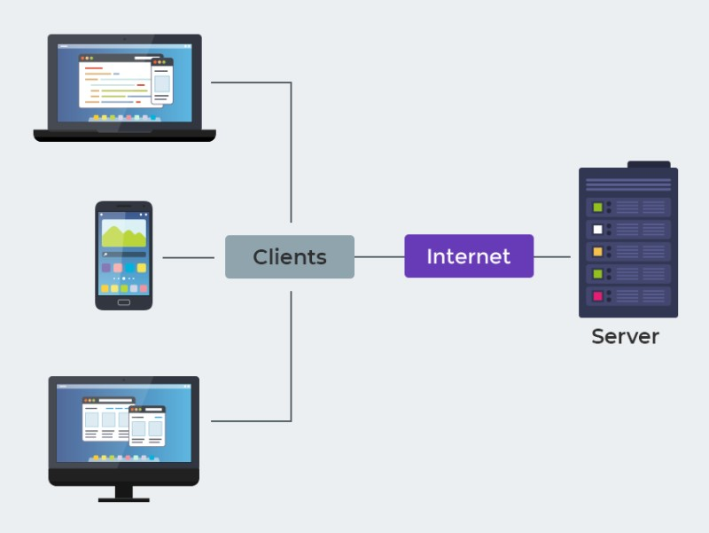

# CozinhaConecta

O CozinhaConecta é um software de automação para food service desenvolvido para oferecer uma solução simples, prática e acessível a pequenos restaurantes e lanchonetes. O sistema é multiplataforma, disponível em versões mobile e desktop, garantindo flexibilidade de uso.

Com o aplicativo mobile, os garçons podem registrar os pedidos diretamente na mesa do cliente, que são enviados automaticamente ao terminal da cozinha, otimizando o atendimento e reduzindo erros. Além disso, o sistema permite comunicação eficiente entre salão e cozinha por meio do envio de mensagens de voz e texto, facilitando a integração da equipe e aumentando a agilidade no serviço.

## 🎨 Design System
O Design Thinking, aplicado à arquitetura de software, é uma abordagem para a solução de problemas que coloca as necessidades do usuário no centro do processo de desenvolvimento. Em vez de focar apenas em requisitos técnicos, ele utiliza empatia, colaboração e experimentação para criar uma estrutura de software que seja não apenas tecnicamente robusta, mas também inovadora e eficaz para o cliente final.

## 🏗️ Arquitetura

### Estilo Arquitetural
Adotamos o estilo arquitetural **Cliente–Servidor**, no qual o processamento é distribuído entre o cliente — responsável pela interface e interação com o usuário — e o servidor, encarregado pelo gerenciamento centralizado dos dados e pela lógica de negócio. Essa escolha promove maior segurança e integridade da informação, pois os dados são mantidos em um único ponto de controle, além de facilitar a administração e a manutenção do sistema.
O modelo Cliente–Servidor atende aos requisitos de um sistema destinado a restaurantes e lanchonetes, uma vez que:
**Suporta escalabilidade**: é possível adicionar novos clientes à rede (por exemplo, novos dispositivos no estabelecimento principal ou em filiais) sem impactos significativos no desempenho, mediante otimização do backend e dimensionamento da infraestrutura de servidores;

- **Simplifica a manutenção**: alterações na lógica ou no banco de dados são realizadas no servidor, sendo refletidas automaticamente nos clientes;

- **Permite múltiplos pontos de acesso**: diversos dispositivos podem operar simultaneamente sobre a mesma base de dados, preservando consistência;

- **Aumenta a segurança**: com controle centralizado de permissões, auditoria e autenticação, reduz-se a exposição de dados sensíveis no cliente.

Dessa forma, o sistema pode ser acessado tanto por dispositivos móveis utilizados pelos garçons para registrar pedidos quanto por desktops ou terminais administrativos utilizados pelo caixa e pela gestão do estabelecimento, garantindo integração em tempo real entre todas as operações.

### Padrão Arquitetural
O padrão arquitetural adotado será o **MVC (Model-View-Controller)**, visando uma separação clara entre regras de negócio, lógica de apresentação e manipulação de dados. Isso facilita a evolução do sistema e promove um desenvolvimento mais organizado.

## Desenho Arquitetural
  
O diagrama representa o estilo arquitetural baseado em Cliente-Servidor, no qual existe uma separação física e lógica entre:

- **Cliente** – onde ocorre a interação do usuário (garçom, caixa, gerente);

- **Servidor** – onde residem as regras de negócio, o processamento e o armazenamento dos dados.

O estilo em questão premite a escalabilidade e centralização. Filiais e dispositivos extras podem ser adicionados sem alterar lógica de negócio.

Dentro do lado servidor, a aplicação segue o padrão arquitetural MVC (Model–View–Controller), o que organiza internamente o código em camadas com responsabilidades bem definidas.

  

Como o MVC se encaixa no lado servidor:

A Camada Função no contexto do sistema
O **Model**	Representa entidades como Pedido, Item, Mesa, Usuário; implementa regras como status do pedido, vínculo com cozinha, persistência em banco.
O **View**	Responsável pelas respostas devolvidas aos clientes (ex.: JSON em APIs REST, páginas no painel web administrativo, ou templates).
O **Controller**	Recebe requisições externas, orquestra modelos, aplica validações de entrada e devolve a resposta adequada.
Benefícios dessa combinação

Fluxo conceitual em contexto (exemplo de pedido pelo garçom):

- O garçom, usando um tablet (cliente), registra um novo pedido.

- O cliente envia uma requisição para o servidor (WebSocket).

- No servidor, o Controller recebe a requisição e decide o que fazer.

- O Controller chama o Model, que implementa as regras de negócio — por exemplo, validar mesa ativa, calcular valor, persistir no banco.

- O Model acessa o banco de dados para gravar o pedido.

- O Controller devolve uma resposta ao cliente, contendo o resultado.

- O cliente atualiza a interface (exibindo confirmação ou detalhes do pedido).

A aplicação do MVC tem como vantagens a organização interna do código e melhor manutenibilidade (facilita evolução do código sem impacto cruzado). Além disso, permite a reutilização do servidor para diferentes tipos de cliente (tablet do garçom, painel do caixa, dashboard do gerente) e é consistente e seguro (validações, permissões e logs centralizados no servidor).

